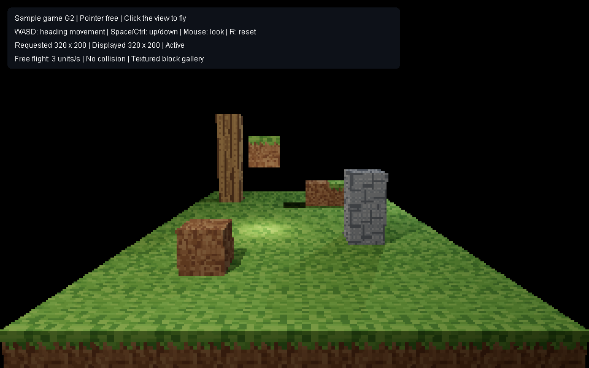

# Sample game: G1 and G2 launch and verification

G2 provides a separate Java 23 application for flying around a textured block gallery. It retains G1 flight controls and uses the public engine without viewport or editor dependencies. Sunlight, sky, collision, and world editing belong to later milestones in [SampleGameRequirements.md](../../SampleGameRequirements.md).

## Launch

From PowerShell in the repository root:

```powershell
./game.ps1
```

The script builds the independent engine, AWT input adapter, and game, then starts `game.SampleGameMain` with Java 23 preview enabled. Set `JAVA_HOME` to a JDK 23 installation if needed; otherwise it uses `C:/Users/andri/.jdks/openjdk-23.0.1`. Use `./game.ps1 -NoBuild` to reuse compiled classes. Startup logs are `out/game/game-stdout.log` and `out/game/game-error.log`.

The window starts at a 960 by 600 content size, with a visible pointer. Click the rendered view to hide and capture the pointer. Mouse look recenters it within the view, allowing continuous turns. If the platform denies pointer control, the overlay reports a mouse-capture error.

| Input | Action |
| --- | --- |
| W / S | Move forward/backward along horizontal camera heading |
| A / D | Move left/right along horizontal camera heading |
| Space / either Ctrl | Move vertically up/down |
| Mouse | Turn right/left and look up/down while captured |
| Escape | Release the pointer and clear held movement |
| R | Restore the starting camera and clear held movement |

Flight speed is three world units per second, with normalized diagonal movement. One cube is one world unit wide. Pitch is limited to 89 degrees in either direction. Elapsed steps are capped at 250 milliseconds after stalls to prevent large jumps.

## Hands-on G1 test — pending

1. Launch with `./game.ps1`, click the view, and fly between the dirt cube, stone stack, suspended grass cube, and distant wood tower. Look upward/downward, fly diagonally, and make several full turns; the window edge should not limit turning.
2. Release all movement keys; the camera should stop. Press Escape; the pointer should be usable on the desktop. Click the view to resume capture.
3. Hold W while switching to another application. Return; the game should have stopped moving and released the pointer. Rendering resumes, but movement and mouse look require another click.
4. Resize between wide and tall windows. Vertical field of view stays fixed; horizontal framing changes. A previous image may briefly be letterboxed while the new aspect renders, but cubes should not stretch.
5. Press R and verify the original viewpoint returns. Close and relaunch; held keys should not survive. Closing shuts down the game update worker and render session.

The overlay shows capture state, controls, requested tracing dimensions, displayed tracing dimensions, and whether rendering is active or suspended. It does not claim a physical input-to-monitor latency measurement.

## Automated evidence — 2026-10-09

Run these commands from the repository root:

```powershell
./game-check.ps1
./verify.ps1
```

Both passed on the development machine using OpenJDK 23.0.1. `game-check.ps1` builds the game against independently compiled engine classes and runs five headless `game.SampleGameTest` cases and seven `engine.CubeTextureTest` cases. Test output is in `out/game-check/tests.log` and `out/game-check/texture-tests.log`; build logs are in the same directory. The repository gate checks formatting and existing scene/engine suites; its test logs are under `out/scene-check/`.

The new tests cover elapsed-time speed, diagonal normalization, heading-relative movement, physical key release, pitch limits, reset/Escape/focus cleanup, fixed vertical framing, shared unit geometry, copied-image stability, suspension/resumption, and update-thread shutdown. A two-second continuous movement check observed at least two distinct completed camera generations. The repository's existing responsive-render tests additionally check coherent captured-camera preview pixels. These checks do not exercise native pointer warping, operating-system focus delivery, or a human playthrough.

The gallery contains 128 shared-geometry cube instances: 117 grass ground cubes and 11 landmark cubes, including one rotated/scaled wood demonstration. The starting requested tracing grid is 320 by 200; resizing adjusts it to the view aspect, within engine limits of 64 through 1600 pixels per axis. G1 uses deterministic depth-zero direct point lighting, one sample per camera view, and the engine's default worker count. Automatic resolution adaptation and the G4 freshness benchmark are deferred. Current results establish basic function, not the later performance target.

The restricted Windows sandbox initially produced the documented JDK error `Cannot close compiler resources`; independent compilation and both verification commands passed outside that sandbox. The new texture path allocates scratch once per worker. One narrow PMD parameter-list exception preserves the existing nine-argument public `Material` constructor; its code comment gives the compatibility rationale. `style-check.ps1 -PruneBaseline` removed or tightened resolved findings without expanding accepted debt. The full repository gate still reports its existing Caps-on synthetic-console skip.

## Representative previews

These PNGs were generated by headless tests and visually checked. The first paints the actual G2 game panel, including its overlay; the second renders the same spawn camera with a portrait aspect. They are not screenshots of a human playthrough.




Regenerate them with `./game-check.ps1`. Display images are copied and tone-mapped while an engine image lease is held; the published AWT image remains independent after the lease is released. `src/game/BlockWorld.java` retains game-owned block coordinates/types and derives ordinary engine instances, allowing later world representations to replace that conversion.


## G2 textures and hands-on test — pending

Original 16 by 16 pixel assets live in `assets/game/`: grass top, grass side, dirt, stone, wood bark, and wood end grain. They were authored for this project; `tools/game/generate_textures.py` reproduces them using Python's standard library. Python is optional for asset regeneration and is not needed to launch the game. The application decodes PNGs and reports missing, malformed, or transparent assets with their absolute paths.

The gallery keeps the earlier point lights and adds a low warm fill light so the elevated grass block's dirt underside can be inspected. G2 still has a black background and deterministic direct lighting; sun/sky and progressive indirect illumination in the game arrive in G3.

1. Launch `./game.ps1`. Click and fly close to grass tops, dirt sides, the stone stack, and wood tower. Pixels should remain crisp and opaque.
2. Fly below the elevated grass block at (-1, 2, 5). Its underside uses dirt; its sides have a grass strip at the top.
3. Fly around the rotated/stretched wood block at (3, 0, 8). Its end grain stays on the top/bottom, and bark follows the side faces through the transform.
4. Inspect repeated blocks and reset with R. Shared textures remain consistent. Repeat the G1 release, focus-loss, resize, and close checks above.


The texture tests verify immutable pixel ownership, sRGB-to-linear conversion, nearest-neighbor face edges, all six face orientations, transformed attachment, point and area lighting, diffuse continuation throughput, material-copy preservation, and repeated texture-edit invalidation. A textured scene save is rejected before replacing an existing file. Untextured scene persistence remains covered by the repository gate. Human native-window and texture inspection remain pending.

Engine consumers can construct `Texture2D(width, height, argbPixels)`, bind separate `CubeTextures(top, bottom, sides)`, and attach them with `Material.withTextures`. Each texel multiplies the material's linear base reflectance. Only diffuse canonical cubes spanning local -1..1 support these bindings; other geometry and mirror/glass materials reject them explicitly. Image rows run top to bottom. On side faces, rows run down from +Y and columns run right when viewed from outside. Top columns point +X and rows +Z; bottom columns point +X and rows -Z. Sampling clamps face edges to the last texel. `CubeTextures.java` specifies the side-face axes precisely.

Historical untextured G1 previews remain [gallery](g1-gallery.png) and [portrait](g1-portrait.png). Current `game-check.ps1` regenerates only the G2 previews.
