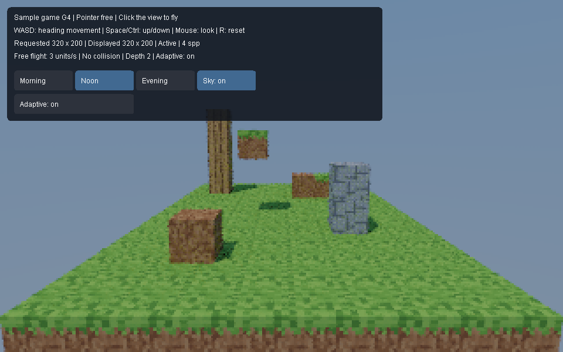
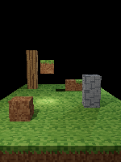
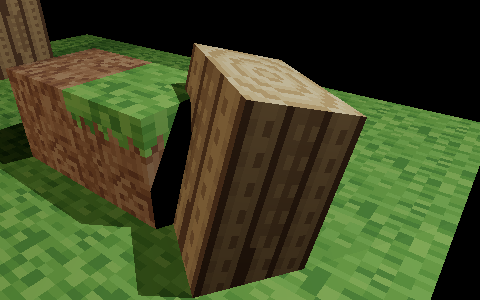
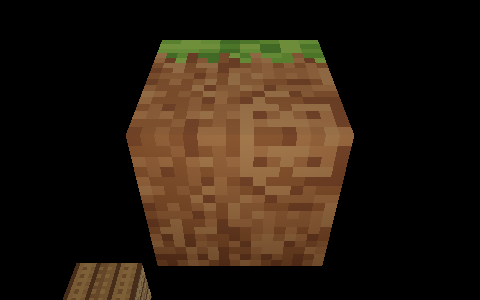
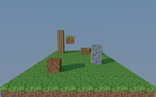
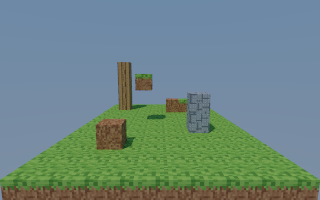
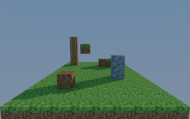
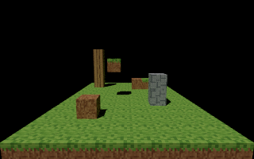
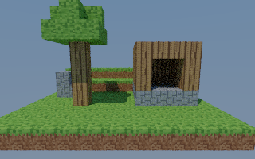

# Sample game: G1 through G4 launch and verification

G4 provides a separate Java 23 application for flying around a small textured landscape under sunlight and a blue sky. The default world has stepped ground, a tree, a stone outcrop, and an open-front wood/stone shelter. It uses the public engine without viewport or editor dependencies. Collision, world editing, and persistence remain future work in [SampleGameRequirements.md](../../SampleGameRequirements.md).

## Launch

From PowerShell in the repository root:

```powershell
./game.ps1
```

The script builds the independent engine, AWT input adapter, and game, then starts `game.SampleGameMain` with Java 23 preview enabled. Set `JAVA_HOME` to a JDK 23 installation if needed; otherwise it uses `C:/Users/andri/.jdks/openjdk-23.0.1`. Use `./game.ps1 -NoBuild` to reuse compiled classes. Launch the retained 128-block gallery with `./game.ps1 -Scene gallery`; use it for the earlier milestone tests below. Startup logs are `out/game/game-stdout.log` and `out/game/game-error.log`.

The window starts at a 960 by 600 content size, with a visible pointer. Click the rendered view to hide and capture the pointer. Mouse look recenters it within the view, allowing continuous turns. If the platform denies pointer control, the overlay reports a mouse-capture error.

| Input | Action |
| --- | --- |
| W / S | Move forward/backward along horizontal camera heading |
| A / D | Move left/right along horizontal camera heading |
| Space / either Ctrl | Move vertically up/down |
| Mouse | Turn right/left and look up/down while captured |
| Escape | Release the pointer and clear held movement |
| R | Restore the starting camera and clear held movement; retain lighting and adaptation |
| Morning / Noon / Evening | Change the fixed sun direction while the pointer is free |
| Sky: on / off | Toggle the background and indirect sky illumination while the pointer is free |
| Adaptive: on / off | Toggle resolution adaptation while the pointer is free |

Flight speed is three world units per second, with normalized diagonal movement. One cube is one world unit wide. Pitch is limited to 89 degrees in either direction. Elapsed steps are capped at 250 milliseconds after stalls to prevent large jumps.

## Hands-on G1 test — pending

1. Launch with `./game.ps1 -Scene gallery`, click the view, and fly between the dirt cube, stone stack, suspended grass cube, and distant wood tower. Look upward/downward, fly diagonally, and make several full turns; the window edge should not limit turning.
2. Release all movement keys; the camera should stop. Press Escape; the pointer should be usable on the desktop. Click the view to resume capture.
3. Hold W while switching to another application. Return; the game should have stopped moving and released the pointer. Rendering resumes, but movement and mouse look require another click.
4. Resize between wide and tall windows. Vertical field of view stays fixed; horizontal framing changes. A previous image may briefly be letterboxed while the new aspect renders, but cubes should not stretch.
5. Press R and verify the original viewpoint returns. Close and relaunch; held keys should not survive. Closing shuts down the game update worker and render session.

The overlay shows capture state, controls, requested tracing dimensions, displayed tracing dimensions, samples per pixel (spp), and whether rendering is active or suspended. It does not claim a physical input-to-monitor latency measurement.

## Automated evidence — 2026-10-09

Run these commands from the repository root:

```powershell
./game-check.ps1
./verify.ps1
```

Both passed on the development machine using OpenJDK 23.0.1. `game-check.ps1` builds the game against independently compiled engine classes and runs five headless `game.SampleGameTest` cases, seven `engine.CubeTextureTest` cases, seven `engine.SunSkyTest` cases, two `game.GameLightingTest` cases, and four `game.GameLandscapeTest` cases. Test output is in `out/game-check/tests.log`, `texture-tests.log`, `sun-sky-tests.log`, `lighting-tests.log`, and `landscape-tests.log`; build logs are in the same directory. The repository gate checks formatting and existing scene/engine suites; its test logs are under `out/scene-check/`.

The new tests cover elapsed-time speed, diagonal normalization, heading-relative movement, physical key release, pitch limits, reset/Escape/focus cleanup, fixed vertical framing, shared unit geometry, copied-image stability, suspension/resumption, and update-thread shutdown. A two-second continuous movement check observed at least two distinct completed camera generations. The repository's existing responsive-render tests additionally check coherent captured-camera preview pixels. These checks do not exercise native pointer warping, operating-system focus delivery, or a human playthrough.

The gallery contains 128 shared-geometry cube instances: 117 grass ground cubes and 11 landmark cubes, including one rotated/scaled wood demonstration. The starting requested tracing grid is 320 by 200; resizing adjusts it to the view aspect, within engine limits of 64 through 1600 pixels per axis. Both game scenes use two continuation bounces, one sample per batch, unlimited stationary refinement (up to the engine sample-count limit), and the engine's default worker count. The sun is the only direct light in the live game; sky fill comes from traced continuation rays. Earlier G1/G2 point-light fixtures remain in the tests. Adaptive resolution is enabled by default, uses the existing P4 policy, and restores the requested grid after 350 ms without camera changes at a completed-job boundary. Turning it off restores the requested grid during motion too. Path depth remains two. The G4 route results below establish headless software freshness; the native-window user test remains pending.

The restricted Windows sandbox initially produced the documented JDK error `Cannot close compiler resources`; independent compilation and both verification commands passed outside that sandbox. The new texture path allocates scratch once per worker. One narrow PMD parameter-list exception preserves the existing nine-argument public `Material` constructor; its code comment gives the compatibility rationale. `style-check.ps1 -PruneBaseline` removed or tightened resolved findings without expanding accepted debt. The full repository gate still reports its existing Caps-on synthetic-console skip.

## Representative previews

These PNGs were generated by headless tests and visually checked. The first paints the actual G4 game panel in gallery mode, including lighting and adaptation controls. The second is the historical G2 point-light portrait fixture. They are not screenshots of a human playthrough.





Regenerate them with `./game-check.ps1`. Display images are copied and tone-mapped while an engine image lease is held; the published AWT image remains independent after the lease is released. `src/game/BlockWorld.java` retains game-owned block coordinates/types and derives ordinary engine instances, allowing later world representations to replace that conversion.


## G2 textures and hands-on test — pending

Original 16 by 16 pixel assets live in `assets/game/`: grass top, grass side, dirt, stone, wood bark, and wood end grain. They were authored for this project; `tools/game/generate_textures.py` reproduces them using Python's standard library. Python is optional for asset regeneration and is not needed to launch the game. The application decodes PNGs and reports missing, malformed, or transparent assets with their absolute paths.

The historical G2 test fixture uses point lights, including a low warm fill for the elevated grass block's dirt underside. Its detail previews below retain that setup. The current game replaces those lights with sun and sky, so shaded faces receive indirect fill that becomes clearer as samples accumulate.

1. Launch `./game.ps1 -Scene gallery`. Click and fly close to grass tops, dirt sides, the stone stack, and wood tower. Pixels should remain crisp and opaque.
2. Fly below the elevated grass block at (-1, 2, 5). Its underside uses dirt; its sides have a grass strip at the top.
3. Fly around the rotated/stretched wood block at (3, 0, 8). Its end grain stays on the top/bottom, and bark follows the side faces through the transform.
4. Inspect repeated blocks and reset with R. Shared textures remain consistent. Repeat the G1 release, focus-loss, resize, and close checks above.





The texture tests verify immutable pixel ownership, sRGB-to-linear conversion, nearest-neighbor face edges, all six face orientations, transformed attachment, point and area lighting, diffuse continuation throughput, material-copy preservation, and repeated texture-edit invalidation. A textured scene save is rejected before replacing an existing file. Untextured scene persistence remains covered by the repository gate. Human native-window and texture inspection remain pending.

Engine consumers can construct `Texture2D(width, height, argbPixels)`, bind separate `CubeTextures(top, bottom, sides)`, and attach them with `Material.withTextures`. Each texel multiplies the material's linear base reflectance. Only diffuse canonical cubes spanning local -1..1 support these bindings; other geometry and mirror/glass materials reject them explicitly. Image rows run top to bottom. On side faces, rows run down from +Y and columns run right when viewed from outside. Top columns point +X and rows +Z; bottom columns point +X and rows -Z. Sampling clamps face edges to the last texel. `CubeTextures.java` specifies the side-face axes precisely.

Historical untextured G1 previews remain [gallery](g1-gallery.png) and [portrait](g1-portrait.png); the original G2 overview remains [gallery](g2-gallery.png). Current `game-check.ps1` regenerates G4 landscape/gallery previews, the G3 lighting comparisons, and the retained G2 detail/portrait fixtures. The original G3 panel preview remains [available](g3-gallery.png).


## G3 sunlight and sky — hands-on test pending

The initial lighting is Noon with the sky enabled. Press Escape to release the pointer and show the lighting buttons. Morning and Evening put the sun on opposite sides of the gallery; Noon puts it higher. These are fixed diagnostic directions, not an advancing day/night clock. Clicking a button changes lighting without capturing the pointer; clicking the view resumes flight. R resets only the camera.

1. Launch `./game.ps1 -Scene gallery`, fly around the raised blocks, and inspect their shadows on the ground. The blue sky is visible behind the scene. Stop briefly to let indirect lighting refine.
2. Press Escape and select Morning, Noon, then Evening. Shadow positions and lengths should change. A previous complete image may remain visible while its replacement renders; the new result must not blend the previous lighting into its accumulation.
3. Select Noon, turn Sky off, and wait for refinement. The background becomes black and sheltered faces darken. Turn Sky on; the blue background and indirect fill return.
4. Approach a directly sunlit face without changing lighting. Its brightness should remain comparable; the sun has no distance falloff. Reset with R and confirm the chosen preset and sky toggle remain unchanged. Repeat G1 focus-loss, resize, and close checks.

These matching spawn-camera previews use 320 by 200 pixels, depth 2, seed 1, and 32 samples per pixel. They were generated without opening a window and visually checked. They show sun-shadow direction changes and the loss of sky fill; they do not establish G4 responsiveness or a human playthrough.









For engine consumers, `DirectionalLight(direction, color, strength)` normalizes a finite nonzero direction pointing **from the surface toward the source**. Color is linear RGB in 0..1; strength is nonnegative irradiance on a perpendicular surface. Diffuse outgoing radiance includes reflectance × color × strength × cosine / pi. Shadow rays extend to infinity. Point lights retain their inverse-square falloff and can coexist with the sun.

Use the five-argument `WorldSnapshot(revision, instances, legacyObjects, lights, sky)` constructor to configure the environment. Its previous four-argument constructor and `WorldSnapshot.of` retain black sky. `Sky(nadir, zenith)` stores nonnegative finite linear radiance at -Y and +Y; interpolation uses `(rayDirectionY + 1) / 2`, so the horizon is halfway. The same world-space sky is visible on primary misses and contributes on continuation misses multiplied by accumulated path throughput. Tracing allocates no per-ray sky or sun scratch.

The public world boundary rejects any mirror, dielectric, or volume instance when directional lights or nonblack sky are present. This is an explicit G3 limitation. Diffuse instances, diffuse emitters, and white diffuse legacy primitives are supported. Existing worlds without these features retain advanced transport. New lighting is not an editable scene-document component and has no persistence format yet.

The lighting suites check source-direction sign, identical illumination at separated surfaces and camera distances, blockers 10,000 units away, combined sun/point contribution, textured sun reflectance, sky endpoint/horizon directions, black defaults, snapshot copying, invalid inputs and unsupported materials, sun/sky edit-and-undo invalidation, leased-image stability, and exact seeded agreement across workers and batch boundaries. For an isolated diffuse surface under constant sky, cosine-weighted sampling gives reflectance × sky radiance per sample; the numerical tolerance is 0.00002 per channel. A 4,096-sample gradient-sky test additionally checks the analytic hemisphere average with absolute tolerance 0.003. Button dispatch and stationary sample growth are tested headlessly.

Additional existing regression suites `engine.ProgressivePathTest`, `engine.DielectricPathTest`, `engine.RoughLightingTest`, and `engine.VolumePathTest` pass. `./style-test.ps1` also passes after extending the game-check script. Human native-window input, texture inspection, and sunlight/sky QA remain pending.

## G4 landscape — hands-on test pending

Launch `./game.ps1`. The 12 by 12 footprint spans block centers x=-6..5 and z=0..11. The ground rises in two short steps at z=7 and z=9. The tree is centered at (-3, 3), the stone outcrop sits nearby, and the shelter occupies x=1..4, z=3..6. Spawn is (0, 2.4, -6), looking along +Z with pitch -0.14 radians. All 313 blocks are ordinary instances sharing unit-cube geometry and one material per block type. Opaque leaves reuse the original grass-top texture on all faces. `BlockWorld` retains the authoritative block coordinates/types; no chunk, mesh-combining, or save format was added.

1. Click to fly from spawn past the tree and into the open-front shelter. Inspect grass, bark, leaves, stone, roof shadows, and shaded interior faces from several heights.
2. Keep moving and turning for at least 30 seconds. Coherent new images should continue to arrive while input stays usable. The displayed grid may drop below the requested grid.
3. Stop. After the engine's 350 ms quiet period and completion of pending work, the requested grid should return and spp should grow, reducing noise. Press Escape and toggle Adaptive off/on to compare movement detail. Depth remains two in either mode.
4. Repeat the G1 reset, release, focus-loss, resize, and close steps in the landscape. Then launch `./game.ps1 -Scene gallery` and repeat the earlier texture and lighting checks.



This preview uses 320 by 200 pixels, depth 2, seed 1, and 8 spp. It was generated headlessly and visually inspected. Automated landscape checks cover deterministic construction, unique coordinates, shared geometry/materials, elapsed-time route interpolation, an exactly stable final pose, fresh previews during motion, reduced grids, restoration/refinement, the adaptation button, suspension/resumption, reset, portrait resizing, and exact seeded image agreement with brute-force traversal. They do not establish human input or native-window behavior.

## G4 reproducible freshness benchmark

From the repository root:

```powershell
./game-benchmark.ps1
# Reuse the game-check classes after the first build:
./game-benchmark.ps1 -NoBuild -NoAdaptive -OutputDirectory out/game-route-fixed
```

Each command runs one complete 30-second warmup and three measured replays sequentially. The second command compares fixed resolution on the same frozen route. Do not run competing benchmarks or builds at the same time. A failed target produces a nonzero exit status while retaining its logs and CSVs.

`benchmarks/game/camera-route.csv` fixes five waypoints: spawn at 0 seconds; (-1, 2, 2), facing the tree, at 8 seconds; (3, 2, 1), facing the shelter, at 16 seconds; and (0, 3.4, 10), facing back across open ground, at 25 seconds. The 30-second waypoint repeats that final pose. Positions and unwrapped yaw/pitch in radians interpolate linearly by elapsed wall time. Slow rendering never slows the camera route. The fixture was frozen before measurement; its SHA-256 is recorded with each run.

The benchmark runs the actual `GameRenderer` update/session/leased-image conversion path without opening a window. It observes every fresh copied-image publication directly; repainting cached images does not count. For the first 25 seconds it includes both the initial wait for a new image and the final hold to movement end. The reported p95 is the nearest-rank 95th percentile of those intervals, with a provisional limit of 200 ms for each replay. The last five seconds separately record the first matching final-camera image at the full requested grid and subsequent sample growth. This measures software image freshness at game publication, excluding actual input delivery, Swing painting, monitor scanout, and physical input-to-monitor latency.

Output contains `metadata.txt` (CPU, JDK, workers, block count, window reference, requested dimensions, transport/sample/adaptation settings, and route hash), `camera-route.csv`, `publications-0.csv` for warmup, `publications-1.csv` through `publications-3.csv`, `summary.csv`, and `benchmark.log`. Each publication records time, displayed dimensions, spp, generation, and captured camera position.

Measured on 2026-10-09 with a 13th Gen Intel Core i5-13600KF (20 logical processors), OpenJDK 23.0.1+11-39, 14 workers, 32-pixel tiles, 313 blocks, a 960 by 600 window reference, and a requested 320 by 200 grid. Depth was 2, seed 1, one spp per batch, unlimited stationary refinement, adaptive resolution on with a 16.67 ms policy target, and temporal presentation/budget off. These settings stayed fixed across warmup and all three replays.

| Replay | Fresh publications during motion | p95 interval (ms) | Maximum interval (ms) | Full grid returned after stop (s) | Full-grid spp: first → final |
| --- | --- | --- | --- | --- | --- |
| 1 | 1083 | 34.733 | 47.777 | 0.431 | 1 → 61 |
| 2 | 1100 | 34.258 | 49.509 | 0.468 | 1 → 60 |
| 3 | 1111 | 34.334 | 48.064 | 0.483 | 1 → 64 |

All three replays passed the 200 ms p95 target and restored/refined full-grid images during the final hold. Raw evidence is checked in under [g4-adaptive](g4-adaptive/summary.csv), including [metadata](g4-adaptive/metadata.txt), per-publication CSVs, the fixture copy, and the benchmark log. Only adaptive-on results are reported here; the fixed-grid comparison command above is available but has not been measured for this delivery. The benchmark checks restart generation boundaries so a previous replay's image cannot count as its first fresh publication.

The target passed using the existing flat object scan. The conditional object-traversal profiling and acceleration work therefore was not triggered; P7 in `PerformanceRequirements.md` remains deferred. These results validate this sample's headless defaults on the development machine, not larger worlds, fixed-grid performance, or a native-window experience. Human G4 QA remains pending.