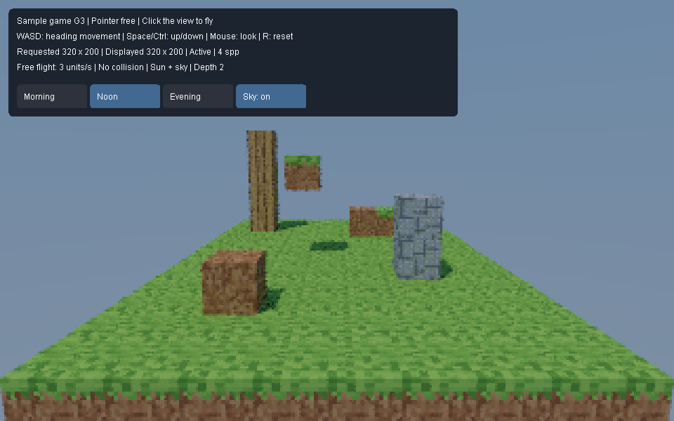

# Sample game: G1 through G3 launch and verification

G3 provides a separate Java 23 application for flying around a textured block gallery under sunlight and a blue sky. It retains G1 flight controls and G2 textures, using the public engine without viewport or editor dependencies. The larger landscape, responsiveness benchmark, collision, and world editing remain future work in [SampleGameRequirements.md](../../SampleGameRequirements.md).

## Launch

From PowerShell in the repository root:

```powershell
./game.ps1
```

The script builds the independent engine, AWT input adapter, and game, then starts `game.SampleGameMain` with Java 23 preview enabled. Set `JAVA_HOME` to a JDK 23 installation if needed; otherwise it uses `C:/Users/andri/.jdks/openjdk-23.0.1`. Use `./game.ps1 -NoBuild` to reuse compiled classes. Startup logs are `out/game/game-stdout.log` and `out/game/game-error.log`.

The window starts at a 960 by 600 content size, with a visible pointer. Click the rendered view to hide and capture the pointer. Mouse look recenters it within the view, allowing continuous turns. If the platform denies pointer control, the overlay reports a mouse-capture error.

| Input | Action |
| --- | --- |
| W / S | Move forward/backward along horizontal camera heading |
| A / D | Move left/right along horizontal camera heading |
| Space / either Ctrl | Move vertically up/down |
| Mouse | Turn right/left and look up/down while captured |
| Escape | Release the pointer and clear held movement |
| R | Restore the starting camera and clear held movement; retain lighting |
| Morning / Noon / Evening | Change the fixed sun direction while the pointer is free |
| Sky: on / off | Toggle the background and indirect sky illumination while the pointer is free |

Flight speed is three world units per second, with normalized diagonal movement. One cube is one world unit wide. Pitch is limited to 89 degrees in either direction. Elapsed steps are capped at 250 milliseconds after stalls to prevent large jumps.

## Hands-on G1 test — pending

1. Launch with `./game.ps1`, click the view, and fly between the dirt cube, stone stack, suspended grass cube, and distant wood tower. Look upward/downward, fly diagonally, and make several full turns; the window edge should not limit turning.
2. Release all movement keys; the camera should stop. Press Escape; the pointer should be usable on the desktop. Click the view to resume capture.
3. Hold W while switching to another application. Return; the game should have stopped moving and released the pointer. Rendering resumes, but movement and mouse look require another click.
4. Resize between wide and tall windows. Vertical field of view stays fixed; horizontal framing changes. A previous image may briefly be letterboxed while the new aspect renders, but cubes should not stretch.
5. Press R and verify the original viewpoint returns. Close and relaunch; held keys should not survive. Closing shuts down the game update worker and render session.

The overlay shows capture state, controls, requested tracing dimensions, displayed tracing dimensions, samples per pixel (spp), and whether rendering is active or suspended. It does not claim a physical input-to-monitor latency measurement.

## Automated evidence — 2026-10-09

Run these commands from the repository root:

```powershell
./game-check.ps1
./verify.ps1
```

Both passed on the development machine using OpenJDK 23.0.1. `game-check.ps1` builds the game against independently compiled engine classes and runs five headless `game.SampleGameTest` cases, seven `engine.CubeTextureTest` cases, seven `engine.SunSkyTest` cases, and two `game.GameLightingTest` cases. Test output is in `out/game-check/tests.log`, `texture-tests.log`, `sun-sky-tests.log`, and `lighting-tests.log`; build logs are in the same directory. The repository gate checks formatting and existing scene/engine suites; its test logs are under `out/scene-check/`.

The new tests cover elapsed-time speed, diagonal normalization, heading-relative movement, physical key release, pitch limits, reset/Escape/focus cleanup, fixed vertical framing, shared unit geometry, copied-image stability, suspension/resumption, and update-thread shutdown. A two-second continuous movement check observed at least two distinct completed camera generations. The repository's existing responsive-render tests additionally check coherent captured-camera preview pixels. These checks do not exercise native pointer warping, operating-system focus delivery, or a human playthrough.

The gallery contains 128 shared-geometry cube instances: 117 grass ground cubes and 11 landmark cubes, including one rotated/scaled wood demonstration. The starting requested tracing grid is 320 by 200; resizing adjusts it to the view aspect, within engine limits of 64 through 1600 pixels per axis. G3 uses two continuation bounces, one sample per batch, unlimited stationary refinement (up to the engine sample-count limit), and the engine's default worker count. The sun is the only direct light in the live game; sky fill comes from traced continuation rays. Earlier G1/G2 point-light fixtures remain in the tests. Automatic resolution adaptation and the G4 freshness benchmark are deferred. Current results establish basic function, not the later performance target.

The restricted Windows sandbox initially produced the documented JDK error `Cannot close compiler resources`; independent compilation and both verification commands passed outside that sandbox. The new texture path allocates scratch once per worker. One narrow PMD parameter-list exception preserves the existing nine-argument public `Material` constructor; its code comment gives the compatibility rationale. `style-check.ps1 -PruneBaseline` removed or tightened resolved findings without expanding accepted debt. The full repository gate still reports its existing Caps-on synthetic-console skip.

## Representative previews

These PNGs were generated by headless tests and visually checked. The first paints the actual G3 game panel, including its lighting controls. The second is the historical G2 point-light portrait fixture. They are not screenshots of a human playthrough.




Regenerate them with `./game-check.ps1`. Display images are copied and tone-mapped while an engine image lease is held; the published AWT image remains independent after the lease is released. `src/game/BlockWorld.java` retains game-owned block coordinates/types and derives ordinary engine instances, allowing later world representations to replace that conversion.


## G2 textures and hands-on test — pending

Original 16 by 16 pixel assets live in `assets/game/`: grass top, grass side, dirt, stone, wood bark, and wood end grain. They were authored for this project; `tools/game/generate_textures.py` reproduces them using Python's standard library. Python is optional for asset regeneration and is not needed to launch the game. The application decodes PNGs and reports missing, malformed, or transparent assets with their absolute paths.

The historical G2 test fixture uses point lights, including a low warm fill for the elevated grass block's dirt underside. Its detail previews below retain that setup. The current G3 game replaces those lights with sun and sky, so shaded faces receive indirect fill that becomes clearer as samples accumulate.

1. Launch `./game.ps1`. Click and fly close to grass tops, dirt sides, the stone stack, and wood tower. Pixels should remain crisp and opaque.
2. Fly below the elevated grass block at (-1, 2, 5). Its underside uses dirt; its sides have a grass strip at the top.
3. Fly around the rotated/stretched wood block at (3, 0, 8). Its end grain stays on the top/bottom, and bark follows the side faces through the transform.
4. Inspect repeated blocks and reset with R. Shared textures remain consistent. Repeat the G1 release, focus-loss, resize, and close checks above.


The texture tests verify immutable pixel ownership, sRGB-to-linear conversion, nearest-neighbor face edges, all six face orientations, transformed attachment, point and area lighting, diffuse continuation throughput, material-copy preservation, and repeated texture-edit invalidation. A textured scene save is rejected before replacing an existing file. Untextured scene persistence remains covered by the repository gate. Human native-window and texture inspection remain pending.

Engine consumers can construct `Texture2D(width, height, argbPixels)`, bind separate `CubeTextures(top, bottom, sides)`, and attach them with `Material.withTextures`. Each texel multiplies the material's linear base reflectance. Only diffuse canonical cubes spanning local -1..1 support these bindings; other geometry and mirror/glass materials reject them explicitly. Image rows run top to bottom. On side faces, rows run down from +Y and columns run right when viewed from outside. Top columns point +X and rows +Z; bottom columns point +X and rows -Z. Sampling clamps face edges to the last texel. `CubeTextures.java` specifies the side-face axes precisely.

Historical untextured G1 previews remain [gallery](g1-gallery.png) and [portrait](g1-portrait.png); the original G2 overview remains [gallery](g2-gallery.png). Current `game-check.ps1` regenerates the G3 previews and the retained G2 detail/portrait fixtures.


## G3 sunlight and sky — hands-on test pending

The initial lighting is Noon with the sky enabled. Press Escape to release the pointer and show the lighting buttons. Morning and Evening put the sun on opposite sides of the gallery; Noon puts it higher. These are fixed diagnostic directions, not an advancing day/night clock. Clicking a button changes lighting without capturing the pointer; clicking the view resumes flight. R resets only the camera.

1. Launch `./game.ps1`, fly around the raised blocks, and inspect their shadows on the ground. The blue sky is visible behind the scene. Stop briefly to let indirect lighting refine.
2. Press Escape and select Morning, Noon, then Evening. Shadow positions and lengths should change. A previous complete image may remain visible while its replacement renders; the new result must not blend the previous lighting into its accumulation.
3. Select Noon, turn Sky off, and wait for refinement. The background becomes black and sheltered faces darken. Turn Sky on; the blue background and indirect fill return.
4. Approach a directly sunlit face without changing lighting. Its brightness should remain comparable; the sun has no distance falloff. Reset with R and confirm the chosen preset and sky toggle remain unchanged. Repeat G1 focus-loss, resize, and close checks.

These matching spawn-camera previews use 320 by 200 pixels, depth 2, seed 1, and 32 samples per pixel. They were generated without opening a window and visually checked. They show sun-shadow direction changes and the loss of sky fill; they do not establish G4 responsiveness or a human playthrough.


For engine consumers, `DirectionalLight(direction, color, strength)` normalizes a finite nonzero direction pointing **from the surface toward the source**. Color is linear RGB in 0..1; strength is nonnegative irradiance on a perpendicular surface. Diffuse outgoing radiance includes reflectance × color × strength × cosine / pi. Shadow rays extend to infinity. Point lights retain their inverse-square falloff and can coexist with the sun.

Use the five-argument `WorldSnapshot(revision, instances, legacyObjects, lights, sky)` constructor to configure the environment. Its previous four-argument constructor and `WorldSnapshot.of` retain black sky. `Sky(nadir, zenith)` stores nonnegative finite linear radiance at -Y and +Y; interpolation uses `(rayDirectionY + 1) / 2`, so the horizon is halfway. The same world-space sky is visible on primary misses and contributes on continuation misses multiplied by accumulated path throughput. Tracing allocates no per-ray sky or sun scratch.

The public world boundary rejects any mirror, dielectric, or volume instance when directional lights or nonblack sky are present. This is an explicit G3 limitation. Diffuse instances, diffuse emitters, and white diffuse legacy primitives are supported. Existing worlds without these features retain advanced transport. New lighting is not an editable scene-document component and has no persistence format yet.

The lighting suites check source-direction sign, identical illumination at separated surfaces and camera distances, blockers 10,000 units away, combined sun/point contribution, textured sun reflectance, sky endpoint/horizon directions, black defaults, snapshot copying, invalid inputs and unsupported materials, sun/sky edit-and-undo invalidation, leased-image stability, and exact seeded agreement across workers and batch boundaries. For an isolated diffuse surface under constant sky, cosine-weighted sampling gives reflectance × sky radiance per sample; the numerical tolerance is 0.00002 per channel. A 4,096-sample gradient-sky test additionally checks the analytic hemisphere average with absolute tolerance 0.003. Button dispatch and stationary sample growth are tested headlessly.

Additional existing regression suites `engine.ProgressivePathTest`, `engine.DielectricPathTest`, `engine.RoughLightingTest`, and `engine.VolumePathTest` pass. `./style-test.ps1` also passes after extending the game-check script. Human native-window input, texture inspection, and sunlight/sky QA remain pending.
